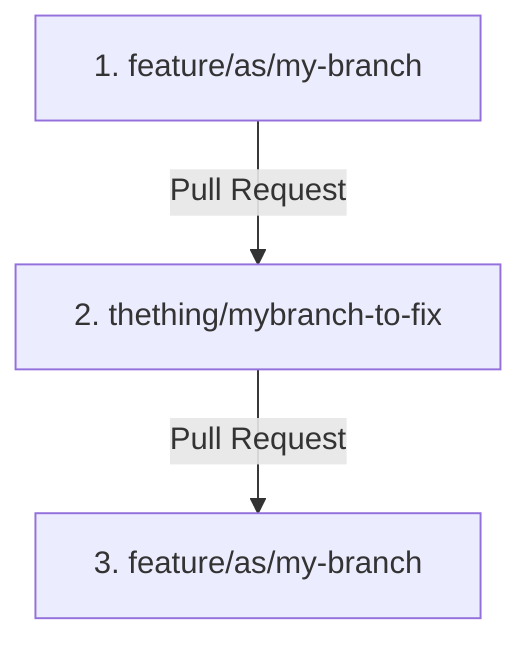
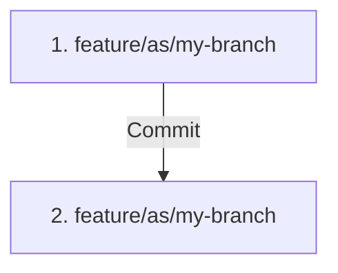

# thething

Bots and Actions for GitHub semi-supervised workflows.

This will introduce commits from a workflow directly into a pull request.

Situations where you may want to do this are in tools such as Databricks or Jupyter,  
where running black or ruff may add some steps.  No more local tooling!

## Status

### Main

### Workflow Dispatch

### Push

## Inspiration

[The Thing](https://en.wikipedia.org/wiki/The_Thing_(1982_film)) is a 1982 American science fiction horror film directed by John Carpenter.

[Jed, as the Dog-Thing](https://en.wikipedia.org/wiki/Jed_(wolfdog)), was a Pacific Northwestern American animal actor.

I  see this style of "save and improve" coding becoming more prevalent with the addition of Copilots and PR Bots.

## Caveats

- This commits to the repo and will change code "on-the-fly" after you commit.
- The unsafe fixes option of ruff additionaly may break code or remove "in-flight" debugging code.
- If you want to revert, the commit will need to be rolled back.
- Having a triggering / branching pattern where this could be run and compared against an existing PR might be beneficial

## Branching Strategies

- If you want to review the code outside of a commit, introducing another PR / branch might be an option.

Example Branching Workflow:

Example In-Branch Workflow

## Improvement Options

- Add some workflow_dispatch conditionals and parameters
- Change the events being used to trigger the actions
- Additional rules for ruff
- Github Templating

## ruff

Ruff, AStRAL, Charlie Marsh and team

https://github.com/astral-sh/ruff

https://github.com/astral-sh

https://github.com/charliermarsh

https://astral.sh/

## pytest

https://github.com/pytest-dev/pytest

## python

https://www.python.org/doc/versions/

## mermaid

https://github.blog/2022-02-14-include-diagrams-markdown-files-mermaid/

## Poetry

https://github.com/search?q=repo%3Aactions%2Fsetup-python%20poetry&type=code

### Editable

https://github.com/orgs/python-poetry/discussions/1135

## Node

https://github.com/npm/node-semver#versions

## GitHub

https://docs.github.com/en/repositories/managing-your-repositorys-settings-and-features/customizing-your-repository/about-code-owners

## GitHub Actions

https://github.com/features/actions

https://github.com/actions/github-script

## GitHub Bots

https://github.com/marketplace/actions/github-project-bot
